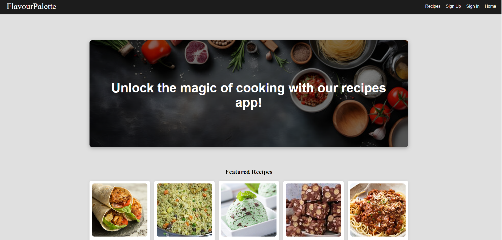

FlavourPalette



# **FlavourPalette**

**Technologies**: Django, Python, React, PostgreSQL  
**Time Frame**: 10 days  
**Project Type**: Solo Project  

## **Project Overview**
FlavourPalette is my take on the perfect recipe management app, built to help users showcase their culinary creations and explore new dishes. With secure authentication and personalized profiles, users can easily create, update, and organize their own recipes while enjoying a browsing experience that's uniquely tailored to them. This project reflects my passion for combining both front-end and back-end development, integrating multiple technologies to create a smooth, intuitive platform that brings out the joy of cooking for everyone.

The application is divided into two main components:
1. **Frontend**: Built using React, this component offers a dynamic user interface for viewing and interacting with recipes.
2. **Backend**: Implemented using Django and Python, it provides robust data management and secure authentication.

## **Live Demo**
Explore the live version of FlavourPalette: [FlavourPalette](https://flavourpalettefront.netlify.app/)

## **Project Links**
- **Frontend Repository**: [Frontend GitHub](https://github.com/anneAC84/React-FlavourPalette.git)
- **Backend Repository**: [Backend GitHub](https://github.com/anneAC84/Django-FlavourPalette.git)
- **Project Planning**:
  - **Trello Board**: [Link to Trello Board](https://trello.com/invite/b/66bfd695325e9e54c0fcaf09/ATTI14388f85fdf130f8774e59d3e752b982918D7AA1/my-django-crud-app-flavourpalette)

## **Features**
### **User Authentication & Authorization**
- Secure user registration and login system using Django’s built-in authentication.
- Personalized profiles for users, allowing them to view, manage, and update their own recipes.
- Users must be logged in to create, edit, or delete recipes.

### **Recipe Management**
- **Create**: Users can upload their own recipes, including details like ingredients, preparation steps, and images.
- **View**: Browse a comprehensive library of recipes, including personal and shared content.
- **Update**: Edit existing recipes to refine or improve them.
- **Delete**: Remove recipes that are no longer needed.

### **User Interaction**
- **Recipe Likes**: Users can engage with the community by liking other users' recipes.
- **Responsive Design**: The app is fully responsive, ensuring a seamless experience across desktops, tablets, and mobile devices.

## **Technologies Used**

### **Frontend**
- **React**: For building the dynamic and interactive user interface.
- **CSS**: Styled components for responsive and attractive design.
- **Netlify**: For seamless deployment of the frontend.

### **Backend**
- **Python & Django**: Core framework for implementing the backend logic and data management.
- **PostgreSQL**: Database for storing recipe data, user profiles, and other essential information.
- **Django REST Framework**: For building the API and managing communication between the frontend and backend.

## **Installation and Setup**

### **Backend Setup**:
1. **Clone the Backend Repository**:  
   ```bash
   git clone https://github.com/anneAC84/Django-FlavourPalette.git